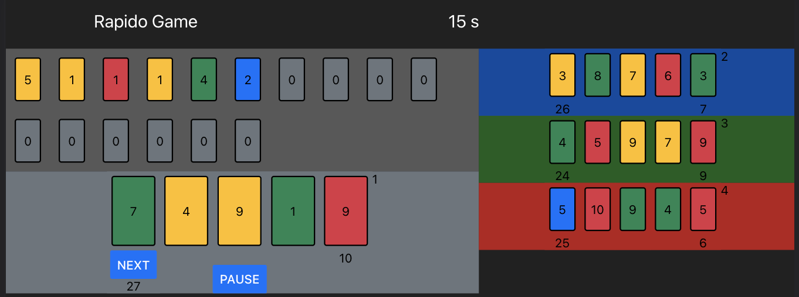

#RAPIDO GAME APP - in React Native

---


Minimum requirements : ...




---
## Installation


1 - Copie du projet en local
```sh
git clone https://github.com/danielp67/rapido-game-app
cd rapido-game-app
npm install --force
```


2 - Lancement
```sh
expo start
```
---

## Lancer les tests :

- Jest :
  ```sh
  npm test
  ```

